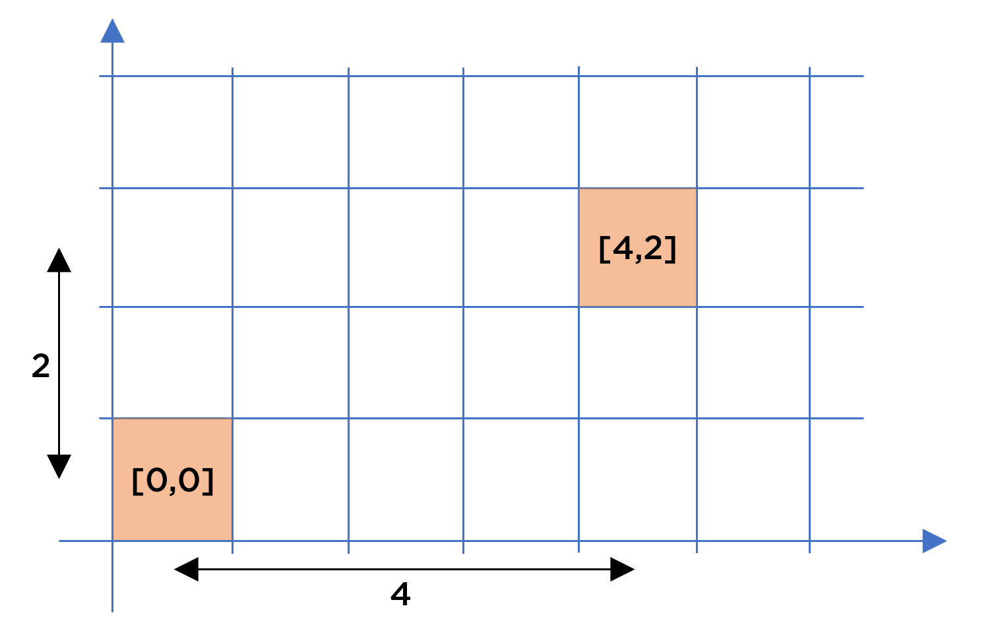
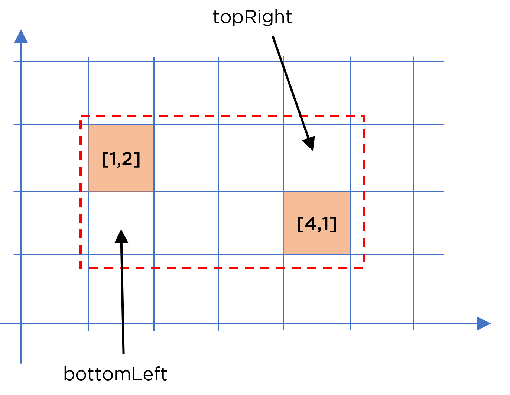

## Complete the 'seed' Function

In `gameoflife.js` complete the function named `seed` that returns its arguments in an array. That is, if the function is called with three arguments (`seed(a,b,c)`) it should return an array containing the three arguments (`[a,b,c]`). Use the `arguments` object to achieve this. 

## Complete the 'same' Function

We need to be able to test if two cells are the same. Complete the function named `same` that accepts two cells and returns a Boolean indicating if the two cells are the same. 

A cell is represented as an array with two integer values. The first value indicates the cell's horizontal distance to the right of the origin ([0,0]). The second value indicates the cell's vertical distance above the origin. Thus, the origin ([0,0]) is the bottom-left of the grid system (although cells with negative coordinates are valid).



## Complete the 'contains' Function

The game state of the cells is represented by an array containing all living cells. For example, `[[3,4], [4,4]]`. All other cells are not alive. 

Complete the function named `contains` that tests if the supplied cell is alive in the passed game state. The cell to test for is passed as a function parameter. The game state must be passed as the `this` value within the `contains` function. Note that this is not a recommended way to implement a function because it hides the state parameter from consumers. It is done here to demonstrate the language feature.

## Complete the 'printCell' Function

Complete the function `printCell` that returns a string representation of a cell's state (is it alive or not?). The first parameter is a cell (the corresponding argument, for example, would be of the form `[x,y]`), and the second is a game state (array of cells). If the cell is alive in the game state the function returns ▣ ('\u25A3'), otherwise it returns ▢ ('\u25A2'). The `contains` function completed previously is an object as well as a function. To determine if the cell is alive, invoke the `contains` function by calling its `call` method (`contains.call(...)`) to set the `contains` function's `this` value to the game state.

## Complete the 'corners' Function

Complete the function `corners` that calculates the top-right and bottom-left coordinates of the smallest rectangle that contains all living cells. The function has a single parameter which is the game state. If no argument is passed, the argument should default to an empty game state (`[]`) using a default parameter. The return value of the function should be an object with two properties, `topRight` and `bottomLeft`. For example, `{topRight: [x,y], bottomLeft: [x,y]}`. If there are no living cells, the `topRight` and `bottomLeft` should both be `[0,0]`.

For example, `corners([[1,2], [4,1]])` returns `{topRight: [4,2], bottomLeft: [1,1]}`.



## Complete the 'printCells' Function

Complete the function `printCells` that uses the `printCell` and `corners` functions completed previously to build a string representation of the game state. `printCells` takes one array parameter of cells. It should output the rectangle of cells defined by the `bottomLeft` and `topRight` values returned from `corners`. For each cell position, it should output the value returned from the `printCell` function. Print a space character between each cell in each row. Print a newline character at the end of each row (including the last row).

For example, `printCells([[3,2],[2,3],[3,3],[3,4],[4,4]])` should return `"▢ ▣ ▣\n▣ ▣ ▢\n▢ ▣ ▢\n"` and, `console.log(printCells([[3,2],[2,3],[3,3],[3,4],[4,4]]))` should output

```
▢ ▣ ▣
▣ ▣ ▢
▢ ▣ ▢
```

## Complete the 'getNeighborsOf' Function

Complete the single-line arrow function `getNeighborsOf` that returns an array containing all of the neighbors of a given cell. A cell always has exactly eight neighbors. Consider the cell `[2,2]`.

```
[1,3] [2,3] [3,3]
[1,2] [2,2] [3,2]
[1,1] [2,1] [3,1]
```

Note that the neighbors of `[2,2]` are `[[1,1], [2,1], [3,1], [1,2], [3,2], [1,3], [2,3], [3,3]]`.

## Complete the 'getLivingNeighbors' Function

Complete the function `getLivingNeighbors` that returns the living neighbors of a given cell within a given game state. The function has two parameters. The first is a cell (the corresponding argument, for example, would be of the form `[x,y]`), and the second is a game state (array of cells). The function should return an array containing all living cells that are neighbors of the cell that is the first function parameter. Use the `contains` function completed previously to check if a neighboring cell is alive. Call `contains` by first using its `bind` method to set the current game state as the value of `this` within `contains`. 

## Complete the 'willBeAlive' Function

Complete the function `willBeAlive` that calculates if a given cell will be alive in the next game state. The function has two parameters. The first is a cell (the corresponding argument, for example, would be of the form `[x,y]`), and the second is a game state (array of cells). A cell is alive in the next game state if and only if:

* the cell has three living neighbors, or,
* the cell is currently alive and has two living neighbors

Use the function `getLivingNeighbors` completed previously to determine how many living neighbors the cell currently has. Use the function `contains` completed previously to determine if the cell is currently alive. Invoke the `contains` function by using its `call` method to supply the current game state as the `this` value within `contains` and call the function. 

## Complete the 'calculateNext' Function

Complete the function `calculateNext` that calculates the next state of the game from the current state of the game. The function has a single parameter `state` that is an array containing all living cells (the current game state). The function should return an array containing all living cells in the next game state.

Use the `corners` function previously completed to establish the extent of the grid to be tested for the next game state. Be sure to extend the search space by one row or column in each direction. For example if `bottomLeft` is `[2,2]` and `topRight` is `[4,4]` then the grid to test for the next game state is from `[1,1]` to `[5,5]`. Use the previously completed function `willBeAlive` to determine if a cell will be alive in the next game state. 

## Complete the 'iterate' Function

Complete the function `iterate` that calculates new game states, based on a starting game state. The function has two parameters. The first parameter is a game state, that is, an array of living cells. The second parameter is an integer indicating how many new game states to calculate. The function should return an array of games states.

For example, if `iterate` is called with a starting game state in the first parameter and the value `2` for the second parameter it will return an array with three game states, the starting game state and two more that were calculated.

The next game state can be calculated by using the `calculateNext` function previously completed, based upon the most recent game state.

## Complete the 'main' Function

Complete the function `main` that calculates a given number of future states from a given starting states and prints them all to the console (including the initial state). The function has two parameters. The first parameter is a string containing the name of one of the game states in the `startPatterns` object, that is: rpentomino, glider or square. The second parameter is an integer indicating how many new game states to calculate. Each game state should be printed with a trailing new line character. 

For example, `main("rpentomino", 2)` will print to the console:

```
▢ ▣ ▣
▣ ▣ ▢
▢ ▣ ▢

▣ ▣ ▣
▣ ▢ ▢
▣ ▣ ▢

▢ ▢ ▣ ▢
▢ ▣ ▣ ▢
▣ ▢ ▢ ▣
▢ ▣ ▣ ▢

```

Use the `iterate` function completed previously to calculate new game states.